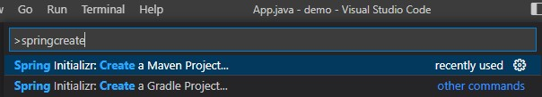
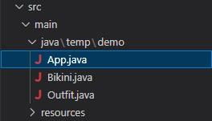
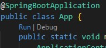

# Chạy Spring Boot trên VS Code

Mở VS Code, nhấn `F1` để hiển thị list commands

Nhập `springcreate` để tạo một project spring boot mới



Sau đó chọn đúng phiên bản của spring boot, tên `Group Id`, `Artifact Id`, `packaging type`... và cuối cùng là folder để chạy project

# Chạy ứng dụng

Trong Java truyền thống, khi chạy cả một project chúng ta phải định nghĩa một hàm `main()` và để nó khởi chạy đầu tiên. Với **Spring Boot** là phải chỉ cho nó biết nơi khởi chạy lần đầu để nó cài đặt mọi thứ

Cách thực hiện là thêm annotation `@SpringBootApplication` trên class chính và gọi `SpringApplication.run(App.class, args);` để chạy project - Đây chính là lệnh để tạo ***container*** sau đó tìm toàn bộ các ***dependency*** trong project của bạn và đưa vào đó

Tại đây phần chính sẽ tạo trên file `App.java`. **Lưu ý: `package temp.demo;` tùy thuộc vào việc khai báo `Group Id`,... trên VS Code**

```
package temp.demo;
import org.springframework.boot.SpringApplication;
import org.springframework.boot.autoconfigure.SpringBootApplication;
import org.springframework.context.ApplicationContext;

@SpringBootApplication
public class App {
    public static void main(String[] args) {
        SpringApplication.run(App.class, args);
    }
}
```

Spring đặt tên cho ***container*** là `ApplicationContext` và đặt tên cho các ***dependency*** là `Bean`

# @Component

Là một Annotation đánh dấu trên các `Class` để giúp Spring biết nó là một `Bean`

Đầu tiên tạo một interface là `Outfit` bằng cách tạo file `Outfit.java`
```
package temp.demo;

public interface Outfit {
    public void wear();
}
```
Implement của nó là Class `Bikini`, tạo file `Bikini.java`
```
package temp.demo;

import org.springframework.stereotype.Component;

/*
 Đánh dấu class bằng @Component
 Class này sẽ được Spring Boot hiểu là một Bean (hoặc dependency)
 Và sẽ được Spring Boot quản lý
*/
@Component
public class Bikini implements Outfit {
    @Override
    public void wear() {
        System.out.println("Mac bikini");
    }
}
```
Cách hoạt động là **Spring Boot** khi chạy sẽ dò tìm toàn bộ các Class cùng cấp hoặc ở trong các package thấp hơn so với class App. Trong quá trình dò tìm này, khi gặp một class được đánh dấu `@Component` thì nó sẽ tạo một instance và đưa vào `ApplicationContext` để quản lý 

Vậy cấu trúc chương trình sẽ được:



Chạy chương trình tại file `App.java` -> nhấn `F5` hoặc nút `Run` như hình 

Kết quả thu được:
```
Instance: temp.demo.Bikini@6b5176f2
Mac bikini
```

# @Autowired
Giờ tạo một Class `Girl` và có thuộc tính là `Outfit`
```
package temp.demo;

import org.springframework.beans.factory.annotation.Autowired;
import org.springframework.stereotype.Component;

@Component
public class Girl {
    @Autowired
    Outfit outfit;

    public Girl(Outfit outfit) {
        this.outfit = outfit;
    }
}
```
Thuộc tính `Outfit` của `Girl` được đánh dấu bởi Annotation `@Autowired`. Điều này nói với **Spring Boot** hãy tự *inject* một instance của `Outfit` vào thuộc tính này khi khởi tạo `Girl`

Lúc này thử chạy `App`
```
package temp.demo;

import org.springframework.boot.SpringApplication;
import org.springframework.boot.autoconfigure.SpringBootApplication;
import org.springframework.context.ApplicationContext;

@SpringBootApplication
public class App {
	public static void main(String[] args) {
		ApplicationContext context = SpringApplication.run(App.class, args);

		Outfit outfit = context.getBean(Outfit.class);

        // In ra để xem thử nó là gì
        System.out.println("Instance: " + outfit);
        // xài hàm wear()
        outfit.wear();

		Girl girl = context.getBean(Girl.class);

        System.out.println("Girl Instance: " + girl);

        System.out.println("Girl Outfit: " + girl.outfit);

        girl.outfit.wear();
	}

}
```
Kết quả:
```
Instance: temp.demo.Bikini@6bab2585
Mac bikini
Girl Instance: temp.demo.Girl@74bdc168
Girl Outfit: temp.demo.Bikini@6bab2585
Mac bikini
```
Như vậy **Spring Boot** đã tự tạo một `Girl` vào trong quá trình tạo đó, nó truyền `Outfit` vào làm thuộc tính

# Singleton
Để ý kết quả thu được `Instance: temp.demo.Bikini@6bab2585` và `Girl Outfit: temp.demo.Bikini@6bab2585` đều cùng là `singleton`, kết quả ở 2 đối tượng trên là một

Tất cả những `Bean` được quản lý trong `ApplicationContext` đều chỉ được tạo ra một lần duy nhất và khi có Class yêu cầu `@Autowired` thì nó sẽ lấy đối tượng có sẵn trong `ApplicationContext` để *inject* vào

Trong trường hợp muốn mỗi lần sử dụng là một instance hoàn toàn mới, đánh dấu `@Component` đó bằng `@Scope("prototype")`
```
@Component
@Scope("prototype")
public class Bikini implements Outfit {
    @Override
    public void wear() {
        System.out.println("Mặc bikini");
    }
}
```
