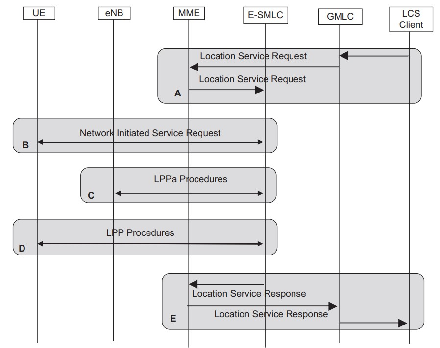

# Tài liệu cần quan tâm:

- Location Base Service https://www.queryhome.com/tech/42618/location-based-services-lcs-architecture-for-lte-eps
- Source code JDiameter: https://jar-download.com/artifacts/org.mobicents.diameter/jdiameter-api/1.7.0.75/source-code
- RestComm/gmlc: https://github.com/RestComm/gmlc
- Documentation: https://documentation.restcomm.com/connect/tutorials/Restcomm%20-%20Geolocation%20API%20gathering%20location%20information%20from%20GSM%20networks.html
- Full doc: https://github.com/RestComm/gmlc/blob/master/docs/adminguide/sources-asciidoc/src/main/asciidoc/Chapter-Overview.adoc

**Mục đích: Tạo GMLC, E-SMLC và các luồng Diameter tương ứng**

## GMLC - Gateway Mobile Location Center

The Gateway Mobile Location Center (GMLC) is the first node an external LCS client accesses in a Mobile Network. The GMLC may request routing information from the HSS. It supports routing of positioning requests and responses. The GMLC also performs authorization and checks the subscriber’s privacy profile.
- The “Requesting GMLC” is the GMLC, which receives the request from the LCS client.
- The “Visited GMLC” is the GMLC, which is associated with the serving node of the target mobile.
- The “Home GMLC” is the GMLC residing in the target mobile’s home PLMN, which is responsible for the control of privacy checking of the target mobile.

## E-SMLC - Enhanced Serving Mobile Location Center

The Enhanced Serving Mobile Location Center (E-SMLC) supports the LCS services function and coordinates positioning of a UE that is attached to LTE. It calculates the final location and velocity estimate and estimates the achieved accuracy.

## Interface:

### SLg Interface
SLg is the interface used by the GMLC to convey a location request to the MME. The interface is also used by the MME to return location results to the GMLC.

### SLs Interface
SLs is the interface between the MME and the E-SMLC. The SLs interface is used to convey location requests and reports between the MME to the E-SMLC. It is also used for tunneling measurement requests from the E-SMLC to the eNodeB.

## GMLC LTE Call Flow

## Positioning Procedure

Figure show outlines a control-plane positioning procedure where an application outside the mobile network requests the position of a target UE

A. An external LCS client requests the current location and optionally the velocity of a target UE. The LCS client may also request a specific position QoS. The GMLC authorizes the LCS client. The GMLC queries the HSS to provide MME address of the target UE and forwards the message to the MME.

B. If the target UE is in Idle mode the MME performs the Network Initiated Service Request procedure to establish a connection with the UE. This means that the MME pages the UE and, when the UE responds, indicating that a signaling connection between the UE and MME is established. In addition, the user may be informed that the UE positioning has been requested and the user may need to confirm that positioning is allowed.

C. Depending on the requested positioning QoS and supported capabilities in the eNodeB, the E-SMLC may initiate an LPPa location procedure towards the eNodeB. The LPPa procedures support mechanisms to obtain positioning measurements for the E-CID positioning method or assistance data for the OTDOA method.

D. In addition to, or instead of step C, the E-SMLC may initiate LPP procedures towards the UE. The LPP procedure supports mechanisms to obtain a location estimate or positioning measurements and to transfer location assistance data to the UE.

E. The E-SMLC provides a location service response to the MME which passes the response further to the GMLC. The GMLC checks that the Privacy profile of the subscriber is fulfilled and passes the response back to the Application/LCS client that requested the positioning.
