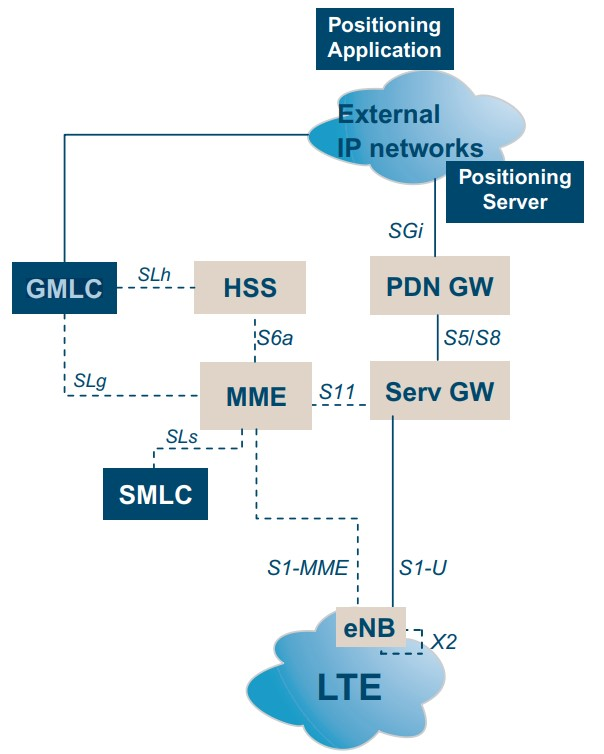

# Tài liệu cần quan tâm:

- Location Base Service https://www.queryhome.com/tech/42618/location-based-services-lcs-architecture-for-lte-eps
- Source code JDiameter: https://jar-download.com/artifacts/org.mobicents.diameter/jdiameter-api/1.7.0.75/source-code
- RestComm/gmlc: https://github.com/RestComm/gmlc

**Mục đích: Tạo GMLC**

## GMLC - Gateway Mobile Location Center

The Gateway Mobile Location Center (GMLC) is the first node an external LCS client accesses in a Mobile Network. The GMLC may request routing information from the HSS. It supports routing of positioning requests and responses. The GMLC also performs authorization and checks the subscriber’s privacy profile.
- The “Requesting GMLC” is the GMLC, which receives the request from the LCS client.
- The “Visited GMLC” is the GMLC, which is associated with the serving node of the target mobile.
- The “Home GMLC” is the GMLC residing in the target mobile’s home PLMN, which is responsible for the control of privacy checking of the target mobile.

## E-SMLC - Enhanced Serving Mobile Location Center

The Enhanced Serving Mobile Location Center (E-SMLC) supports the LCS services function and coordinates positioning of a UE that is attached to LTE. It calculates the final location and velocity estimate and estimates the achieved accuracy.

## Interface:

### SLg Interface
SLg is the interface used by the GMLC to convey a location request to the MME. The interface is also used by the MME to return location results to the GMLC.

### SLs Interface
SLs is the interface between the MME and the E-SMLC. The SLs interface is used to convey location requests and reports between the MME to the E-SMLC. It is also used for tunneling measurement requests from the E-SMLC to the eNodeB.

## GMLC LTE Call Flow

