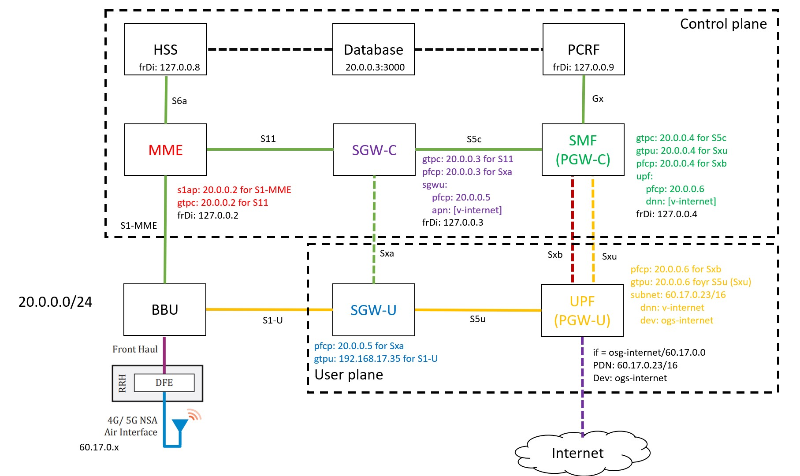

# Open5GS bằng Docker

Repositorie này chứa các phần:
- :heart_eyes: Chạy Open5gs với phần user plane, control plane, kết hợp eNB, UE bằng srsRAN
- :sunglasses: Sơ lược về hệ thống Location Based Services, sử dụng GMLC, E-SMLC
- :stuck_out_tongue_winking_eye: Vài note về Java, Spring Framework
- :sleepy: Note về JDiameter

[Video thực hiện](https://www.youtube.com/watch?v=6pnh7TqTU6c)

## Contributors:
- [Ma Viet Duc](https://github.com/maduc238)
- [Pham Thanh Hai](https://github.com/ahihi8z8z)

### Mục lục

[1. Tạo gateway giao tiếp](#nung)

[2. Pull các image từ Docker Hub](#slong)

[3. Docker Run các image vừa nhận được](#slam)

[4. Chạy các Container và config chúng](#sli)
- [4.1. Phần User Plane](#slinung)
- [4.2. Phần Control Plane](#slislong)
- [4.3. Phần eNB, UE](#slislam)

[5. Công việc thực hiện](#ha)



<a name="nung"></a>
## 1. Tạo gateway giao tiếp
Thêm gateway có ip là 20.0.0.1
```
docker network create --gateway 20.0.0.1 --subnet 20.0.0.0/24 4g
```
Sơ đồ cấu hình:
```
-------------        -----------------------        --------------------   if: ogs-internet 60.17.0.23/16
|  eNodeB   |        |  EPC Control Plane  |        |  EPC User Plane  |------------------------------------- INTERNET
-------------        -----------------------        --------------------
      |                         |                            |
      |  20.0.0.20              |  20.0.0.2,3,4              |  20.0.0.5,6                  if: 20.0.0.0/24
    ------------------------------------------------------------------------------------------------------------
```
Bảng thông tin Docker:
| Docker # | Thành phần | IP Address | OS |
| --- | --- | --- | --- |
| EPC Control Plane | MME <br> SGW-C <br> SMF | 20.0.0.2/24 <br> 20.0.0.3/24 <br> 20.0.0.4/24 | Ubuntu 20.04 |
| EPC User Plane | SGW-U <br> UPF | 20.0.0.5/24 <br> 20.0.0.6/24 | Ubuntu 20.04 |
| srsRAN | eNodeB, UE | 20.0.0.20/24 | Ubuntu 20.04 |

Kiểm tra network cho Docker bằng lệnh
```
docker network ls
```

<a name="slong"></a>
## 2. Pull các image từ Docker Hub
Docker của phần User Plane:
```
docker pull maduc238/open5gs:user-plane
```
Docker của phần Control Plane:
```
docker pull maduc238/open5gs:control-plane 
```
Docker của srsRAN
```
docker pull aothatday/open5gs:srsenb
```

<a name="slam"></a>
## 3. Docker Run các image vừa nhận được
**Lưu ý: Hai Docker chạy trên 2 terminal khác nhau**

User Plane: yêu cầu kết nối với mạng, do đó cần tạo interface ảo với mode tun
```
docker run --name open5gs-u -d -t --cap-add=NET_ADMIN --cap-add=NET_RAW --net 4g --ip 20.0.0.5 --device /dev/net/tun maduc238/open5gs:user-plane
```

Có thể chạy trên mạng của máy chính: `--network host`

Control Plane:
```
docker run --name open5gs-c -d -t --cap-add=NET_ADMIN --cap-add=NET_RAW --net 4g --ip 20.0.0.2 maduc238/open5gs:control-plane
```
Thêm port kết nối máy chính, ví dụ: `-p 36412:36412/sctp`

srsRAN:
```
docker run --name srsenb -d -t --privileged -v /dev/bus/usb:/dev/bus/usb --net 4g --ip 20.0.0.20 aothatday/open5gs:srsenb
```

<a name="sli"></a>
## 4. Chạy các Container và config chúng
<a name="slinung"></a>
### 4.1. Phần User Plane
Cấu hình mạng và chạy container:

Lưu ý: Cần chỉnh ip của interface S1-U (gtpu) cho SGW-U: `vim install/etc/open5gs/sgwu.yaml`

```
docker exec -it open5gs-u bash 
```
```
ip addr add 20.0.0.6/24 dev eth0 
```
```
ip tuntap add name ogs-internet mode tun 
```
```
ip addr add 60.17.0.23/16 dev ogs-internet 
```
```
ip link set ogs-internet up 
```
```
iptables -t nat -A POSTROUTING -s 60.17.0.23 ! -o ogs-internet -j MASQUERADE 
```

**Lưu ý: Sửa IP nếu có chỉnh sửa trước khi chạy trong sgw-u**
```
cd home/open5gs 
./run.sh 
```
<a name="slislong"></a>
### 4.2. Phần Control Plane
Cấu hình mạng và chạy container:
```
docker exec -it open5gs-c bash 
```
```
ip addr add 20.0.0.3/24 dev eth0 
```
```
ip addr add 20.0.0.4/24 dev eth0 
```
```
cd open5gs 
./run4g_cp.sh 
```
Vào phần web UI:
Truy cập địa chỉ [20.0.0.2:3000](http://20.0.0.2:3000)
Tên đăng nhập: `admin`
Mật khẩu: `1423`

<a name="slislam"></a>
### 4.3. Phần eNB, UE
**Lưu ý: Chạy eNB và UE trên 2 terminal khác nhau**

**Trên eNB:**
```
docker exec -it srsenb bash
```
```
cd srsRAN/srsenb
../build/srsenb/src/srsenb ./enb.conf 
```
**Với eNB thật, sửa `file /root/.config/srsran/enb.conf` và chạy `srsenb`**

**Trên UE:**
```
docker exec -it srsenb bash
```
```
cd srsRAN/srsue
../build/srsue/src/srsue ./ue.conf
```

<a name="ha"></a>
## 5. Công việc thực hiện
Lấy id của subnet 4g tạo lúc đầu
```
docker network ls | grep 4g
```
Máy chủ Docker: capture các gói tin chuyển qua interface mới tạo của docker có dạng br-id
```
sudo wireshark
```
Các máy container: dùng tcpdump bắt các gói trong interface loopback
```
tcpdump -i lo -s 65535 -w loopback.pcap
```
